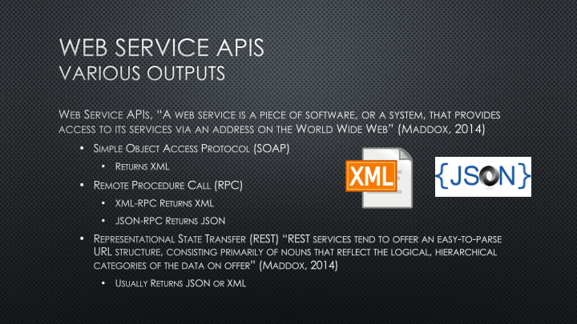

# How to use an API
## (And what is it anyway?)
```
Author: Bree Norlander
Date: 2020-03-28
```
---
API is the acronym for Application Programming Interface. An API does the work of retrieving data in a variety of forms from its original home to a source that is requesting that data. The source may be you making a request through the web or it may be a mobile app retrieving map data from Google. A search for What is an API will result in many great tutorials. I found a quick 3-minute video that covers this topic well and will prepare you for the remainder of the lecture. Note, this video is put out by a company but I do not mean it as an endorsement for the company, I just like their concise description. Let’s take a look…

[](//youtu.be/s7wmiS2mSXY?t=3 "What is an API?")

So why should a data curator be interested in APIs? You’ve probably guessed by now that the answer is APIs deliver data!


APIs provide the messenger service you need to collect data from sites like Twitter, MySportsFeeds, RottenTomatoes, Twitch, Bloomberg and more… Most of these sites will require you to apply for an API key and may have restrictions on the use of their data. For example, RottenTomatoes, states “Please note that at this time we no longer support unauthorized use of our data (e.g. unofficial projects, non-user facing data integrations).”

If you are interested in working with data, whether it be as a Data Curator, a Government Docs Librarian, or a Data Scientist, it will benefit you to be familiar with APIs.

As is the case with repositories, data portals, and everywhere else, data retrieved from an A.P.I. may be presented in a variety of different formats. When you use a web service A.P.I. you will mainly see outputs in the form of Extensible Markup Language known as XML or javascript object notation known as JSON. A web service as a piece of software or a system that provides access to its services via a url. This means that if the A.P.I. does not require authentication, the output can be viewed directly in a web browser.  There are three types of web service A.P.I.s:
+ simple object access protocol or SOAP which returns an X.M.L. object
+ remote procedural call R.P.C. which returns either an X.M.L. or JSON object depending on which format they're using
+ or the most common right now representational state transfer or REST 

REST services tend to offer an easy to parse URL structure consisting primarily of nouns that reflect the logical hierarchical categories of the data on offer. I will show you an example of what that means below. REST A.P.I.s usually return JSON or X.M.L. but can sometimes also return different formats such as CSV.


