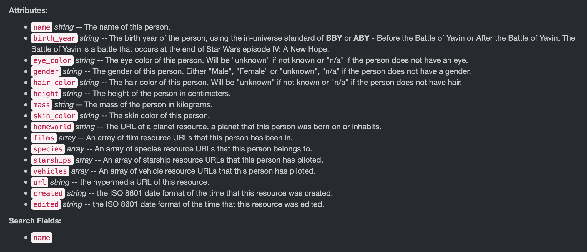

# How to use an API
## (And what is it anyway?)
```
Author: Bree Norlander
Date: 2020-03-28
```
---
API is the acronym for Application Programming Interface. An API does the work of retrieving data in a variety of forms from its original home to a source that is requesting that data using a specific set of rules. The source may be you making a request through the web or it may be a mobile app retrieving map data from Google. A search for What is an API will result in many great tutorials. I found a quick 3-minute video that covers this topic well and will prepare you for the remainder of the tutorial. Note, this video is put out by a company but I do not mean it as an endorsement for the company, I just like their concise description. Let’s take a look...

[](//youtu.be/s7wmiS2mSXY?t=3 "What is an API?")

So why should a data curator be interested in APIs? An API is a common tool for retrieving data.


APIs provide the messenger service you need to collect data from sites like [Twitter](https://developer.twitter.com/en/docs/api-reference-index), [MySportsFeeds](https://www.mysportsfeeds.com/data-feeds/), [RottenTomatoes](https://developer.fandango.com/rotten_tomatoes), [Twitch](https://dev.twitch.tv/docs/api/), and more. Most of these sites will require you to apply for an API key and may have restrictions on the use of their data. For example, RottenTomatoes, states “Please note that at this time we no longer support unauthorized use of our data (e.g. unofficial projects, non-user facing data integrations).”

If you are interested in working with data, whether it be as a Data Curator, a Government Docs Librarian, or a Data Scientist, it will benefit you to be familiar with APIs.

As is the case with repositories, data portals, and an email from your boss, data retrieved from an API may be presented in a variety of different formats. When you use a "web service" API you will mainly see outputs in the form of eXtensible Markup Language known as XML, JavaScript Object Notation known as JSON (or geoJSON for geographic data), or Comma Separated Values known as CSV. A **web service** as a "[system or software that uses an address, i.e., URL on the World Wide Web, to provide access to its services](https://rapidapi.com/blog/types-of-apis/)". This means that the API output can be viewed directly in a web browser. The three most common types of web service APIs are:
+ simple object access protocol or SOAP which returns an XML object
+ remote procedural call R.P.C. which returns either an XML or JSON object depending on which format they're using (XML-RPC or JSON-RPC)
+ and the most common right now is REpresentational State Transfer or REST which is not a protocol but rather a set of architectural principles ([read](https://www.ics.uci.edu/~fielding/pubs/dissertation/top.htm) the dissertation that coined the phrase)

REST services tend to offer an easy to parse URL structure consisting primarily of nouns that reflect the logical hierarchical categories of the data on offer. I will show you an example of what that means below. REST APIs usually return JSON or XML but can sometimes also return different formats such as CSV.


Let’s take a look at a simple REST API example. This API is from Paul Hallet and is called [SWAPI](https://swapi/co): The Star Wars API. Paul [writes](https://swapi.co/about), "After hours of watching films and trawling through content online, we present to you all the People, Films, Species, Starships, Vehicles and Planets from Star Wars." SWAPI is built just to be an API, while other web applications may use the data, this API wasn't built with any particular application in mind. I did some searching of the backend of website (hosted on [Github](https://github.com/phalt/swapi/)) and found that the data are available in six JSON files: films.json, people.json, planets.json, species.json, starships.json, and vehicles.json. You'll note that these files match with Paul's list of datasets in the quote above. In [REST naming conventions](https://restfulapi.net/resource-naming/), these datasets are referred to as "Resources" and as we see here, should be a noun indicating what is within the Resource. The SWAPI API, because it's built using a REST architecture, allows us to view the output from our API query directly in the browser. Let’s check out the People data. 

The [SWAPI documentation](https://swapi.co/documentation#people) tells us that queries within the People Resource will result in the following "Attributes":



It also notes that searches will only happen with the Name attribute field. 

The highest level search we can do within the People Resource is also the URL with which we will begin our queries: [`https://swapi.co/api/people/`](https://swapi.co/api/people/). You can go directly to that URL in your broswer to see the first 10 data entries in the People Resource. This API requires you to paginate through the entries in intervals of 10. Fortunately, it tells you exactly how many entries there are and what the API query will be for the next page:


The pagination system is not ideal and makes it more tedious to grab all the data in the People dataset. I don't think it's common to see it set up this way. Let's try a query for Name in the People Resource. We need to follow the REST rules for querying.
