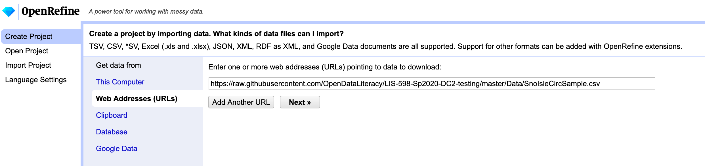
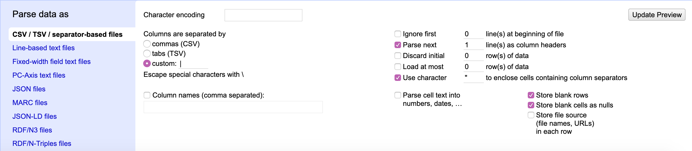
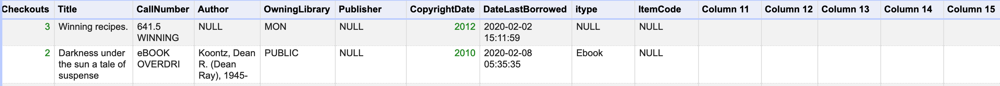

# Using Library Data
```
Author: Bree Norlander
Date: 2020-04-17
```
---
This will be a combination of exercises and learning about data retrieved from an Integrated Library System. We will start with circulation data that the Sno-Isle Library System in WA kindly provided to us. 

Sno-Isle uses [Polaris](https://www.iii.com/products/polaris-ils/) ILS. In order to gather six months of circulation by title data, the IT Manager ran the following SQL query to generate a csv:

```
select COUNT(distinct th.TransactionID) as [TotalCheckouts],
     br.BrowseTitle as [Title],
	   br.BrowseCallNo as [CallNumber],
	   br.BrowseAuthor as [Author],
	   o.Abbreviation as [OwningLibrary],
	   bs.data as [Publisher],
	   br.PublicationYear as [CopyrightDate],
	   MAX(ir.LastCircTransactionDate) as [DateLastBorrowed],
	   c.Name as [itype],
	   mt.Description as [ItemCode]
from PolarisTransactions.Polaris.TransactionHeaders th (nolock)
LEFT JOIN PolarisTransactions.Polaris.TransactionDetails tdmt (nolock)
	on th.TransactionID = tdmt.TransactionID and th.TransactionTypeID = 6001 and tdmt.TransactionSubTypeID = 4 --material type
LEFT JOIN PolarisTransactions.Polaris.TransactionDetails tdc (nolock)
	on th.TransactionID = tdc.TransactionID and tdc.TransactionSubTypeID = 61 -- collection
LEFT JOIN PolarisTransactions.Polaris.TransactionDetails tdi (nolock)
	on th.TransactionID = tdi.TransactionID and tdi.TransactionSubTypeID = 38 -- item record
LEFT JOIN Polaris.Polaris.ItemRecords ir (nolock)
	on ir.ItemRecordID = tdi.numValue
LEFT JOIN Polaris.Polaris.BibliographicRecords br (nolock)
	on br.BibliographicRecordID = ir.AssociatedBibRecordID
LEFT JOIN Polaris.Polaris.Organizations o (nolock)
	on o.OrganizationID = ir.AssignedBranchID
LEFT JOIN Polaris.Polaris.MaterialTypes mt (nolock)
	on mt.MaterialTypeID = tdmt.numValue
LEFT JOIN Polaris.Polaris.Collections c (nolock)
	on c.CollectionID = tdc.numValue
LEFT JOIN Polaris.Polaris.BibliographicTags bt (nolock)
	on bt.BibliographicRecordID = br.BibliographicRecordID and bt.TagNumber = 264
LEFT JOIN Polaris.Polaris.BibliographicSubfields bs (nolock)	
	on bs.BibliographicTagID = bt.BibliographicTagID and bs.Subfield = 'b'
where th.TranClientDate between DATEADD(MM, -6, GETDATE()) and GETDATE()
GROUP BY br.BrowseTitle, br.BrowseCallNo, br.BrowseAuthor, o.Abbreviation, bs.Data, br.PublicationYear, c.Name, mt.Description
```

Each ILS will have its own unique method for generating data, it won't always be a SQL query. This query resulted in 2,829,503 rows of data. It's a large dataset that is too big to store here in Github, so we've cut it down to a nice [sample](https://raw.githubusercontent.com/OpenDataLiteracy/LIS-598-Sp2020-DC2-testing/master/Data/SnoIsleCircSample.csv) of 100 rows to work with. If you click on the link, you will be able to see the data right in your browser which will be handy for reference, but for our next step, we will also be opening the data in the open-source application [OpenRefine](https://openrefine.org/). If you don't have it installed on your machine, you will find the download [here](https://openrefine.org/download.html).

OpenRefine is a tool designed to clean up messy data. Once you have it installed, open up the application (which will open and run in your default browser tab) and in the left menu choose "Create Project". OpenRefine has a handy tool for using data from a URL, so you can choose "Web Addresses (URLs)" to start your project and enter the link above to the data (https://raw.githubusercontent.com/OpenDataLiteracy/LIS-598-Sp2020-DC2-testing/master/Data/SnoIsleCircSample.csv). Click "Next."



OpenRefine automatically tries to detect the separator used in the file, but allows the use to change the detection paramaters.



You'll notice that the file is in comma-separated value (CSV) format. Does that match the reality of the file? How can you tell?

If you look at the [raw data]((https://raw.githubusercontent.com/OpenDataLiteracy/LIS-598-Sp2020-DC2-testing/master/Data/SnoIsleCircSample.csv)) in your browser, and scan the first row, which in this case is the column header names, you will see that this file is NOT separated by commas, but rather by pipes |. This is definitely an uncommon separator value, but OpenRefine still caught it and noted that the columns were separated by a custom value. If OpenRefine hadn't detected this, you would want to change this parameter before continuing on with the data. You should also note that OpenRefine detected the first row as the column headers and has chosen to fill empty cells with NULL. OpenRefine can also auto-detect data types. This may be useful when cleaning the data later, so go ahead and check the box next to "Parse cell text into numbers, dates, ..." These settings look fine for this dataset, but before continuing, take a look at the table shown above the parameters. Do you notice anything unexpected? How many columns has OpenRefine detected?



OpenRefine has detected 15 columns, 5 of which it has auto-named as "Column #". It appears that many of the cells in these columns are empty and not even filled with "NULL". When you scroll down a bit, you'll notice that row 23 is the first row to include data within columns 11-15. Continue scrolling and you'll notice that row 68 also contains data within those columns. Both of these entries are materials in Russian. Even if you don't read Russian, you should be able to notice that CopyrightDate and the DataLastBorrowed columns are not matching up with the data correctly in these two rows. Keep this information in mind because you will need to clean this data at a later point.

Go ahead now and click "Create Project" (feel free to rename your project if you prefer).
