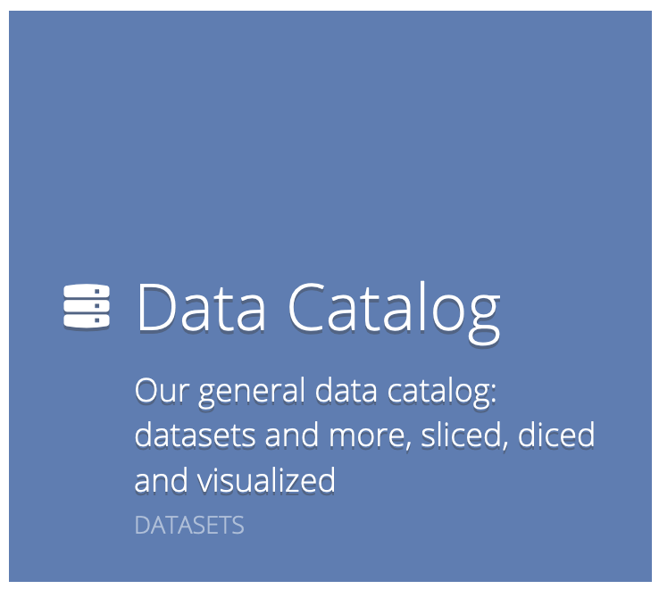
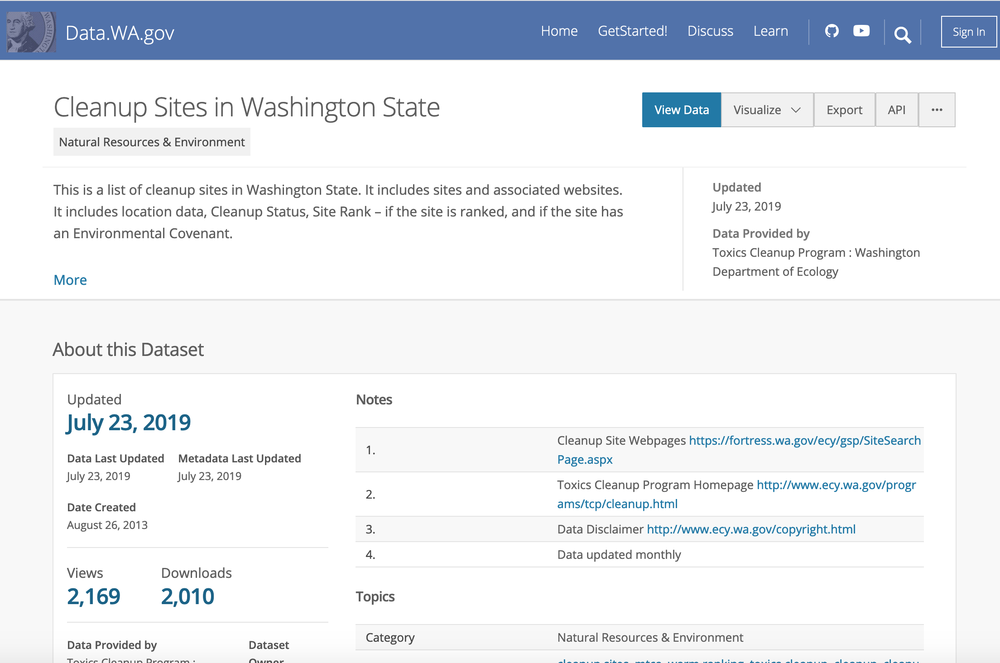
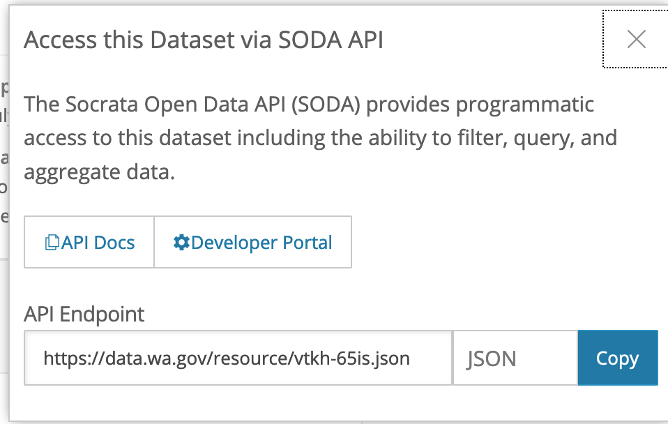

# Using the Socrata API to Access WA State Data
```
Author: Bree Norlander
Date: 2020-04-03
```
---
## Data.wa.gov

In this demonstration and exercise, we'll look at the [State of Washington's data portal](https://data.wa.gov/), which is built on a [Socrata](https://www.tylertech.com/products/socrata/data-platform) platform. Socrata has created a custom API called SODA (Socrata Open Data API) which is very similar to a REST API. They also have a custom query language called SoQL or “Socrata Query Language”. It will be important to refer to the [SODA API Documentation](https://dev.socrata.com/consumers/getting-started.html) throughout this demonstration.

Start by visiting the state data portal homepage at [https://data.wa.gov/](https://data.wa.gov/). There are actually several different portals listed here on the homepage. For this demo we are going to look specifically at the Socrata platform which can be accessed by clicking on "Data Catalog."



Here you will see everything available on the data catalog, from datasets, to maps, to filtered views, and more. We will specifically be looking at Datasets. So go ahead and filter your view to just Datasets by clicking "Datasets" in the View Types of the faceted search interface on the left of the screen. Here you see all of the datasets hosted on the state data portal. Let's take a look at a specific example. Search for "Cleanup Sites in Washington State" and filter again to Datasets. We're looking for the dataset with that specific title, which you should be able to find [here](https://data.wa.gov/Natural-Resources-Environment/Cleanup-Sites-in-Washington-State/vtkh-65is).



Take some time to familiarize yourself with what is available on this page including metadata, data preview, and content made with this data. When you have an idea of the data that's available in the dataset, click the API link near the top of the page.



If you click "Copy" on the API endpoint and paste this URL into a browser window, you will see all the data. Depending on which brower you use, you may see this JSON file formatted in an easy to navigate format or a raw textual format. This is nice, but we could have just exported the data and viewed it in our preferred software. The API endpoint is an easy way to import data programatically into data analysis tools such as Tableau and R. But you can also use to API to filter the data to exactly what you need, to avoid downloading or importing files that are too large. So we have the api endpoint URL [`https://data.wa.gov/resource/vtkh-65is.json`](https://data.wa.gov/resource/vtkh-65is.json), let's figure out how to filter the data to see only sites which are in King County.
